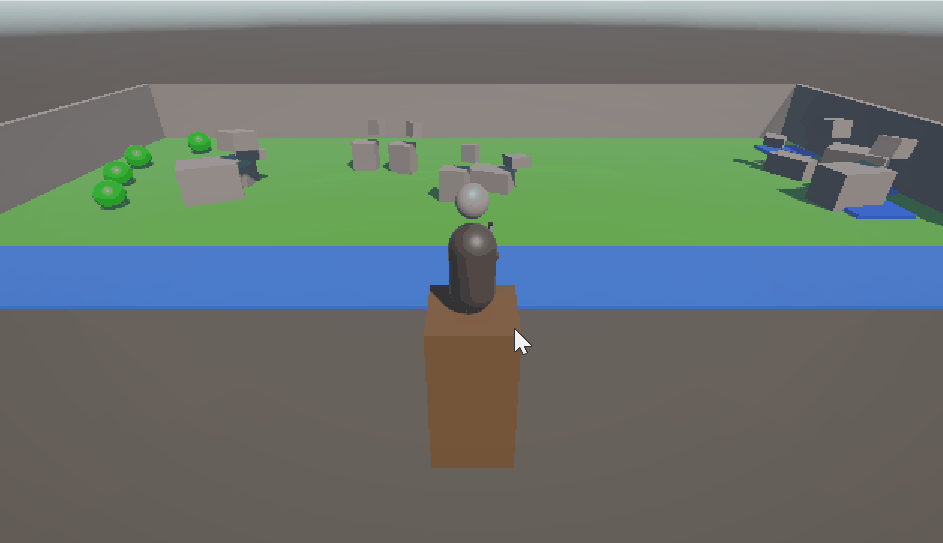

# hunter-prey-rl

Two rl agents trained separately in unity ml-agents.
hunter learns to shoot moving targets via 15 stage curriculum.
prey learns to find food and water under hunger and thirst drives.

## hunter

Archery agent on a fixed tower. observes via 51 ray vision cone, picks
continuous actions for body yaw, head yaw and pitch, bow pitch, and bow draw,
plus a discrete release action.

Curriculum: 15 phases from big slow target at fixed distance to multiple
small fast targets across the full arena. all difficulty dimensions vary
together each phase to avoid the policy locking onto easy assumptions.

reward: +10 per kill, small step penalty, episode ends on first kill.

## prey

deer/pig/cow with different speed and health stats. observes its own hunger,
thirst, health, head direction, and a 51 ray vision cone tagged by layer
(food, water, river, npc, animal, obstacle). 4 continuous actions for forward,
turn, head yaw, head pitch.

food on left side of arena, water on right. spawns asymmetrically so it
always starts with one need high and on the wrong side. river to the south
kills it on contact.

reward: hrrl style drive reduction. drive = sqrt(hunger^2 + thirst^2),
reward at each step = (prev_drive - cur_drive) * 50. so reducing whichever
need is more pressing pays more. plus episode penalties for dying and a
flat survival bonus for finishing the episode.

## training

both trained with ppo via ml agents.

mlagents-learn config/archery.yaml --run-id=archery_v1 --num-envs=4
mlagents-learn config/prey.yaml --run-id=prey_v1 --num-envs=4

## Improvements I would of made if I did it again from the start

- co train them from the start. trained separately, integrating after was painful
- 112 obs is overkill for both. could probably do half, I wasn't sure how many raycasts I needed at beginning so went for more
- prey doesnt observe the hunter as a threat, as prey's were trained alone

## stack

unity 6, ml agents, ppo, onnx export for inference.
